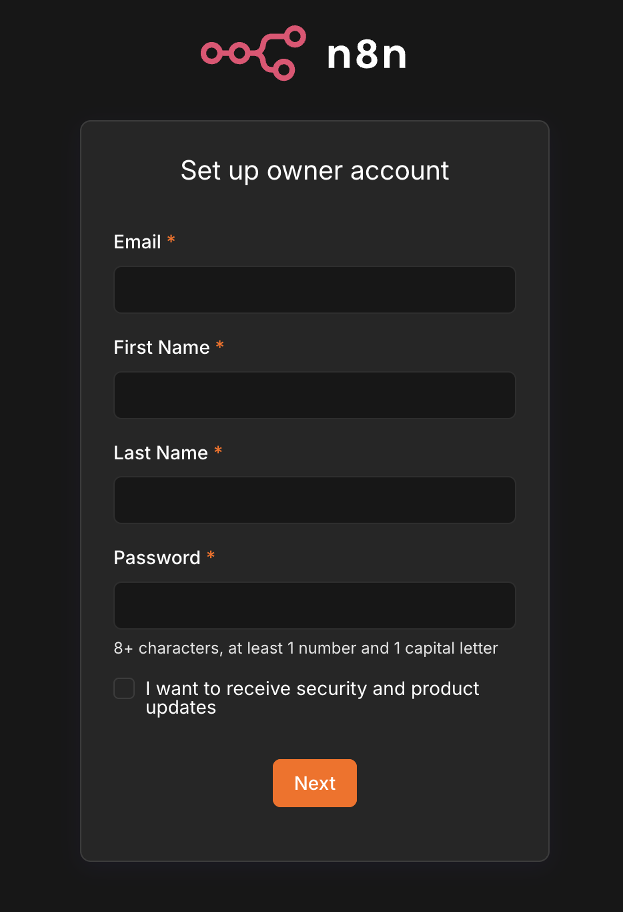
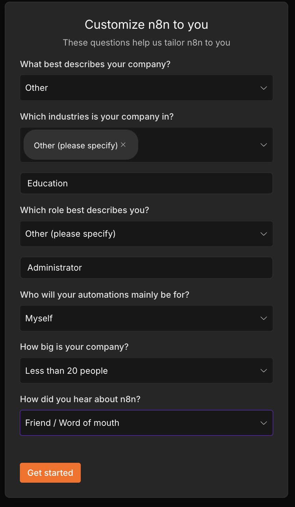
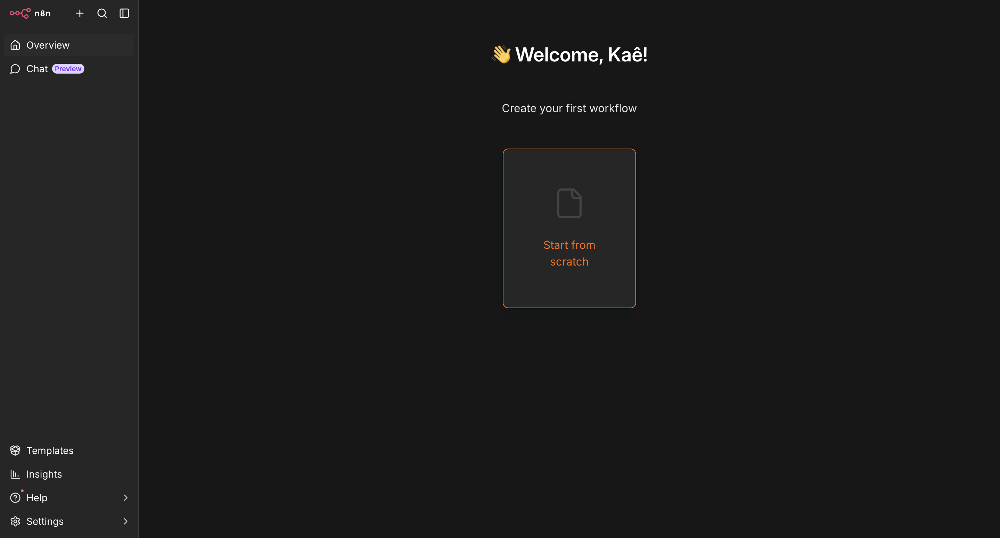
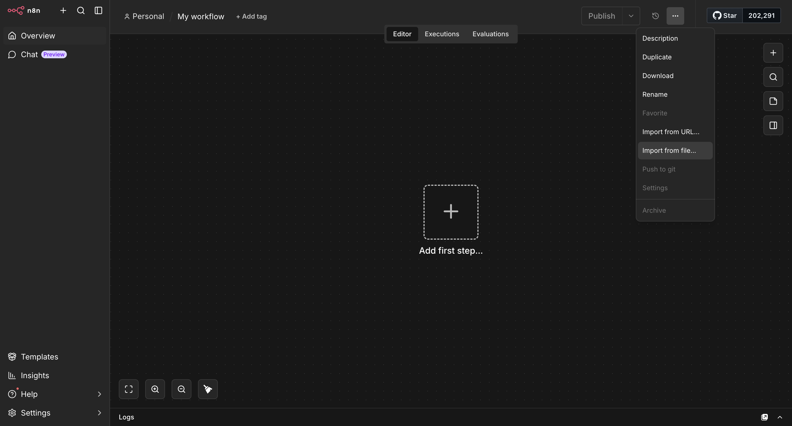
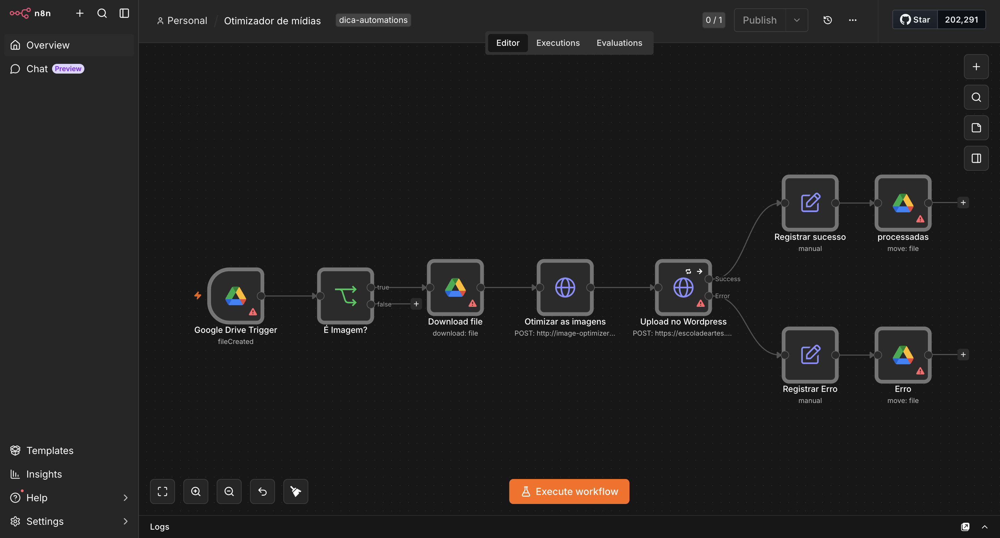
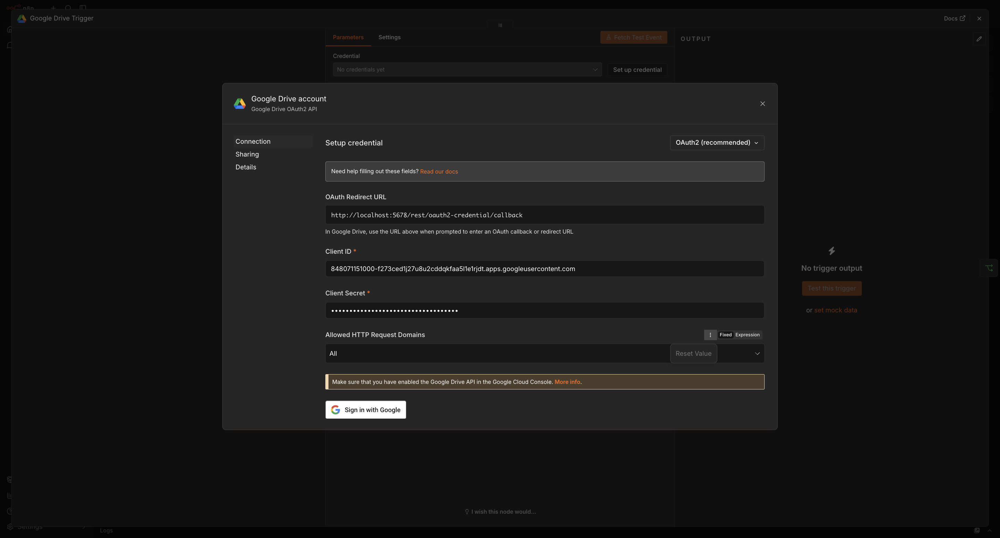
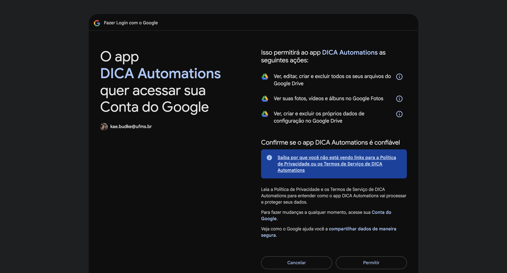
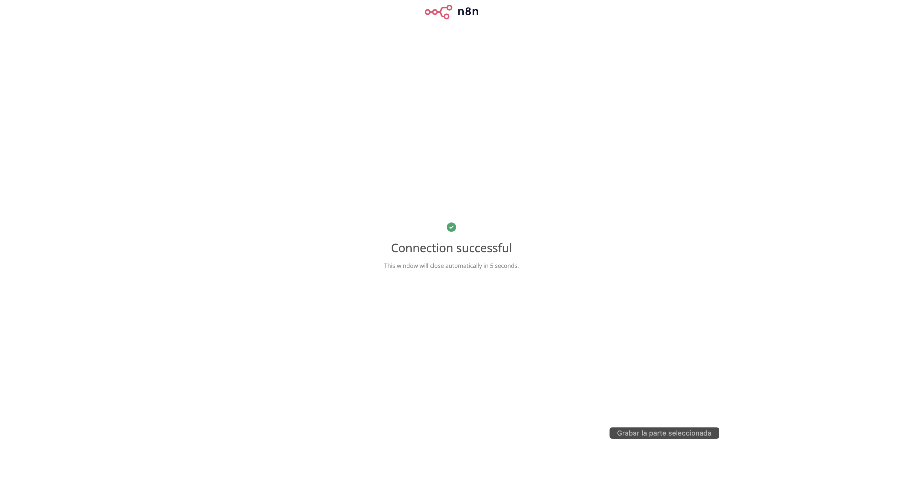
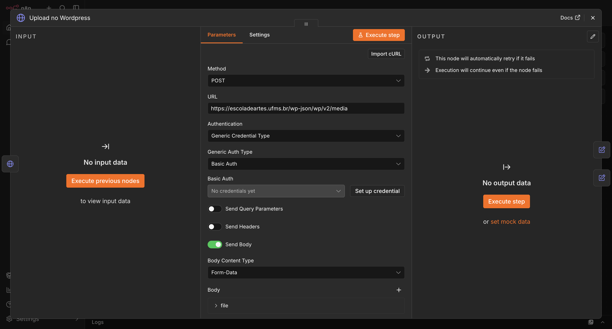
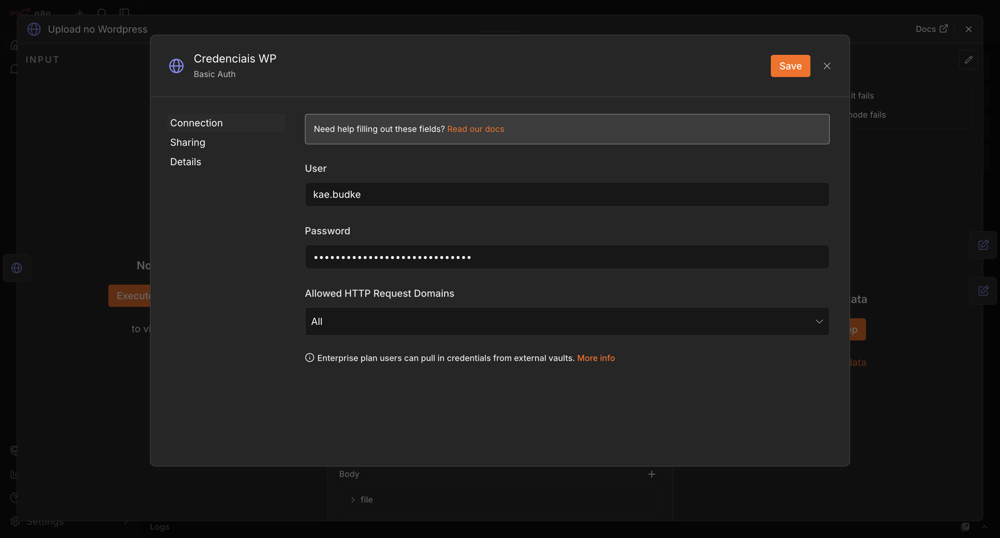

# Otimizador de imagens para WordPress

Esta aplicação realiza a otimização do tamanho das imagens que são reconhecidas na pasta `entrada` e posteriormente é enviada para pasta de `processadas` ou de `erro`, localizadas no *Google Drive*.

## Processo da automação

1. `Google Drive Trigger`: O início é dado pelo clique manual no início do processo. Este fará uma comunicação com o Google Drive e o mesmo retorna um arquivo `json` sobre o status da pasta escolhida.
2. `É imagem?`: o nodo verifica se os arquivos da pasta recebidos pelo drive é uma imagem, ou seja, se o `mime-type` do arquivo começa com `image/`.
3. `Baixar arquivo`: sendo um arquivo de mídia uma imagem, o orquestrador baixa a imagem identificada.
4. `Otimizar as imagens`: em seguida, a imagem é repassada para a aplicação responsavel `image-optimizer` por otimizar os arquivos num tamanho adequado para o servidores web.
5. `Upload no WordPress`: recebendo a imagem com tamanho reduzido, o n8n realiza a autenticação no WordPress e sobe a imagem para as mídias do site.
6. `Registrar sucesso ou erro`: cada caso de sucesso ou fracasso será registrado para melhor depuração de erros e melhorias contínuas.
7. `Mover para pasta de destino (processadas ou erros)`

## 0. Preparando os ambientes

- [Google Drive](#no-google-drive)
- [WordPress](#no-wordpess)
- [Na sua máquina | Windows](#na-sua-máquina)
- [Na sua máquina | Linux](#na-sua-máquina)
- [N8N](#no-n8n)

### No Google | Drive e Cloud Platform

As pastas no drive estão organizadas com a seguinte estrutura:
```bash
/wordpress/
|
|-- /entrada/
|-- /processadas/
|-- /erros/
```

- `entrada`: pasta onde serão colocadas as imagens de interesse.
- `processadas`: pasta destino que vai receber as imagens processadas e otimizadas pela aplicação.
- `erros`: pasta destino que recebe todos aqueles processamentos que deram erro.

Basta solicitar o acesso à elas com o email de preferência ou criar novas pastas e linká-las no nodo do Drive pelo `n8n`. 

#### Credenciais | Google Cloud Plataform (GCP)

O GCP é necessário para realizar a comunicação entre os serviços que estamos utilizando da Google e o (orquestrador) `n8n`. 

> Nosso limite diário é de 10.000 solicitações gratuitas que são renovadas diariamente.

Nesse sentido, você pode criar um projeto no [Google Cloud Plataform (GCP)](https://console.cloud.google.com/) ou entrar em contato comigo para criar um novo cliente com as credenciais de acesso.

### No WordPess

Com seu acesso à área administrativa do WordPress, vá em `Usuários` >> `Perfil` e desça até encontrar as senhas de aplicação.

Em seguida, escreva o nome da sua aplicação e crie uma nova senha no botão `Adicionar senha de aplicativo`. Copie e guarde para mais tarde. 

Esta será utilizada durante o processo de autenticação básica do orquestrador `n8n`.


### Na sua máquina

#### Windows

1. `Instalando o Docker`: Caso não tenha, instale a aplicação responsável por isolar os ambientes. 
2. `Subindo o n8n`: Com o docker rodando e configurado, abra o powershell e digite `docker compose up -d`.

### No `n8n`

1. Após executar o comando, no seu navegador, entre no endereço http://localhost:5678 e você verá a página inicial do `n8n`:

> 
> 
> Configure com o seu email, nome e senha de preferência.

2. Clicando em `Next`, você vai se deparar com alguns popups com perguntas para customizar a ferramenta. Não é necessário, mas ele também não permite remover. Basta seguir o exemplo:

> 
> 

3. Nosso próximo passo é subir o [arquivo json](./otimizador%20de%20imagens.json) que está neste repositório, contendo o esqueleto da automação. Para isso, vamos no canto superir direito e selecionamos `Import from file...` para selecionar o arquivo `json`.

> 
> O resultado deve ser semelhante a esta imagem:
> 

#### Configurando as credenciais | Drive

Conforme já comentado lá [em cima](./README.md#no-google--drive-e-cloud-platform), você vai precisar configurar o acesso à sua conta google pelo `n8n`. As informações são:

- `Client ID`: 848071151000-f273ced1j27u8u2cddqkfaa5l1e1rjdt.apps.googleusercontent.com
- `Client Secret`: <sua-chave-secreta>

O resultado vai percorrer nessa linha aqui:

> 
> 
> 


#### Configurando as credenciais | WordPress

Entre no nodo `Upload no Wordpress` e você vai encontrar algo semelhante a isso:




## Dúvidas ou sugestões

### Não sou desenvolvedor

Qualquer dúvida ou sugestão que venha a ter ao utilizar o programa, [manda um oi no whatsapp](https://wa.me/5567998933949) ou envie um [email](mailto:kae.budke@gmail.com) contendo suas contribuições.

### Sou desenvolvedor ou iniciante na área

Se você é desenvolvedor ou está começando na área e quer contribuir com o projeto, fique à vontade para participar! Toda contribuição é bem-vinda, seja corrigindo um problema, melhorando a documentação ou sugerindo uma nova funcionalidade.

Para contribuir:

1. Acesse o [repositório do projeto no GitHub](https://github.com/budkee/otimizador-imagens-n8n-wordpress).
2. Faça um fork do projeto para a sua própria conta.
3. Clone o repositório para o seu computador.
4. Crie uma nova branch para a sua contribuição, evitando trabalhar diretamente na branch principal.
5. Faça as alterações que deseja implementar e, se possível, adicione ou atualize os testes correspondentes.
6. Faça o commit das alterações com uma mensagem clara e objetiva.
7. Envie a branch para o seu fork no GitHub ou GitLab.
8. Abra um Pull Request ou Merge Request para propor a inclusão das suas alterações no projeto original.

Antes de enviar sua contribuição, procure verificar se já existe uma issue relacionada ao que você pretende modificar. Caso não exista, você também pode abrir uma nova issue para explicar o problema, apresentar uma sugestão ou discutir uma possível implementação.

Não se preocupe se ainda está começando: contribuições de diferentes níveis de experiência são bem-vindas. Se tiver dúvidas sobre como contribuir, consulte a documentação do projeto ou entre em contato.

## Melhorias

1. Ajustar para que a automação retire ou crie o [Texto alternativo, Título, Legenda e Descrição]
